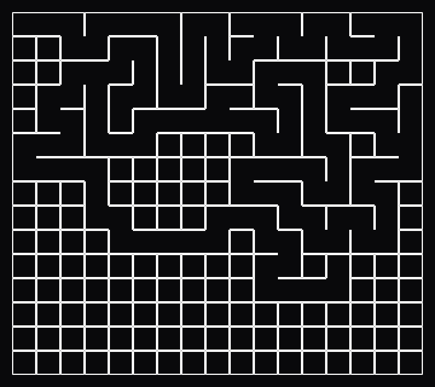

# 🌀 Maze Generator & Solver

Welcome to the **Maze Generator & Solver**, a Next.js application that allows users to create, solve, and download mazes interactively.

## 🚀 Features

- 🏗️ **Generate Mazes** - Create unique mazes with customizable sizes.
- 🎮 **Maze Game** - Play an interactive game within the maze.
- 🔍 **Generation Visualizer** - Watch how the maze is generated step by step.
- 🎨 **Customization** - Adjust maze size, difficulty, and appearance to your preference.
- 🧩 **Solve Mazes** - Visualize the shortest path from start to finish.
- 📥 **Download Mazes** - Save your generated maze as an image.
- ⚡ **Fast & Responsive** - Built with Next.js and optimized for performance.

## 🛠️ Tech Stack

- **Frontend:** Next.js, Tailwind CSS
- **State Management:** Zustand
- **Image Export:** dom-to-image

## 📦 Installation

1. Clone the repository:
   ```bash
   git clone https://https://github.com/Bit2b/Amaze.git
   cd Amaze
   ```
2. Install dependencies:
   ```bash
   npm install
   ```
3. Start the development server:
   ```bash
   npm run dev
   ```

## 📸 Screenshots

**Game**
<br>

.png)

**visualization**
<br>



**Generation**
<br>

.png)

## 📜 License

This project is licensed under the MIT License.

---

🌟 **Enjoy solving mazes!**
